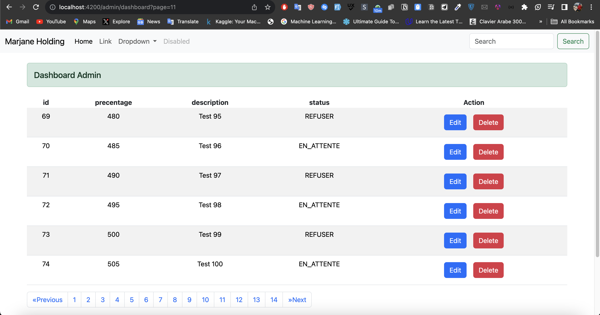
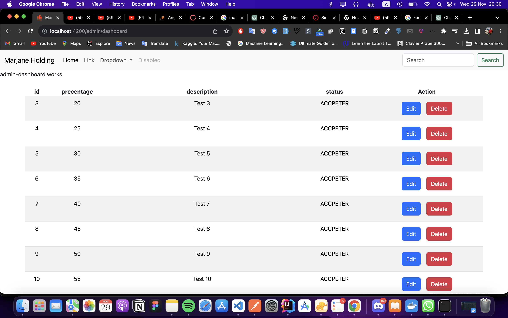
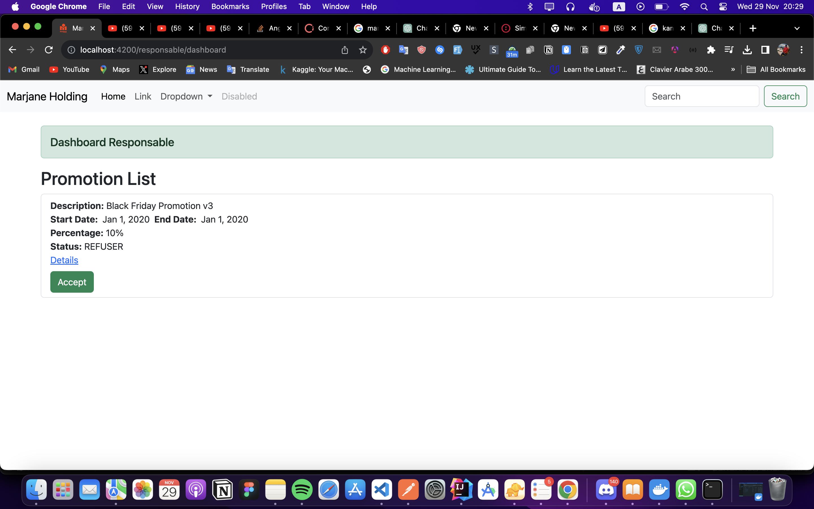
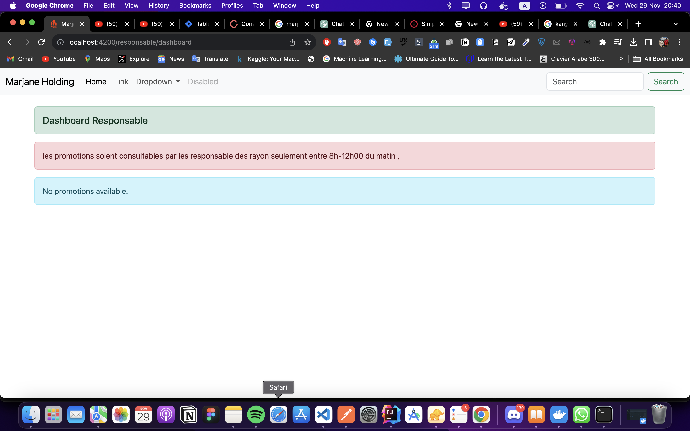

# Marjane Promotion api

## screenshots






## Contexte du projet

L'hypermarché Marjane Maroc souhaite simplifier la gestion des promotions de ses produits dans tous les centres du royaume. L'administrateur général du groupe Marjane prend en charge la gestion de chaque administrateur de centre par ville. Chaque centre est géré par un seul administrateur, et la gestion des promotions se fait quotidiennement au niveau de chaque centre. L'administrateur crée une liste de promotions par catégorie de produits, et un responsable de rayon est responsable d'accepter ou de refuser les promotions en fonction du stock disponible.

## Fonctionnalités principales

- Gestion des promotions par catégorie de produits.
- Acceptation ou refus des promotions par les responsables de rayon.
- Consultation des promotions appliquées et non appliquées par l'administrateur du Marjane.
- Consultation des promotions uniquement entre 8h et 12h par les responsables de rayon.
- Enregistrement de chaque opération dans un fichier de journalisation et dans la base de données.
- Statistiques des promotions sur l'interface de l'administrateur général.
- Limites de promotion en fonction du prix, de la quantité en stock et de la catégorie de produits.
- Gestion de la validité des promotions.
- Création de clients Marjane avec carte de fidélité par les agents de caisse.
- Envoi par email du code de carte fidélité avec l'historique d'achat au client Marjane.
- Les produits avec promotion n'ont aucune garantie.

## Règles générales

- Chaque promotion ne doit pas dépasser 50% du prix du produit.
- Les produits avec une quantité inférieure à 20 unités peuvent avoir une promotion de 70%.
- Chaque réduction de 5% vaut 3dhs de points de fidélité.
- Les promotions des produits multimédia ne doivent pas dépasser 15%.

## Travail demandé par Marjane

1. Proposer une maquette pour la page du responsable de rayon.
2. Ajouter un fichier Trello/Jira pour la gestion du projet.
3. Ajouter la partie frontEnd en utilisant Angular pour les pages suivantes:
   - Dashboard Admin Centre pour ajouter une promotion.
   - Dashboard Responsable Rayon pour accepter ou refuser les promotions.

## Maquette de la page Responsable de Rayon

(Insérez ici une maquette de la page du responsable de rayon, incluant les fonctionnalités nécessaires.)

## Gestion de Projet avec Trello/Jira

(Insérez ici le lien vers le fichier Trello ou Jira pour la gestion du projet.)

## Partie FrontEnd avec Angular

Le code source pour la partie frontEnd, développée en Angular, se trouve dans le répertoire "frontEnd". Suivez les instructions suivantes pour l'installation et l'exécution du frontEnd.

### Installation

```bash
cd frontEnd
npm install
```

### Exécution

```bash
ng serve
```

Accédez à l'application dans votre navigateur à l'adresse [http://localhost:4200/](http://localhost:4200/).

## Remarques importantes

- Chaque promotion a une durée de validité modifiable par l'administrateur du centre Marjane.
- Les promotions sont consultables entre 8h et 12h. Si une promotion est lancée à 8h00, elle sera visible par le responsable du rayon jusqu'à 12h, après quoi elle sera considérée comme non appliquée dans le système.
